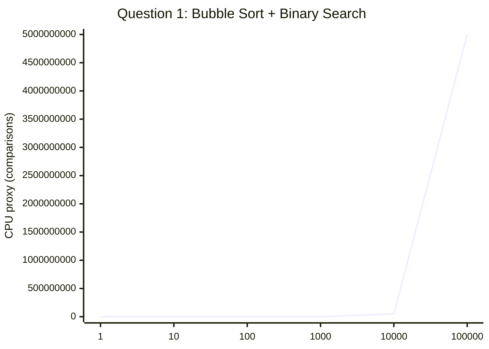
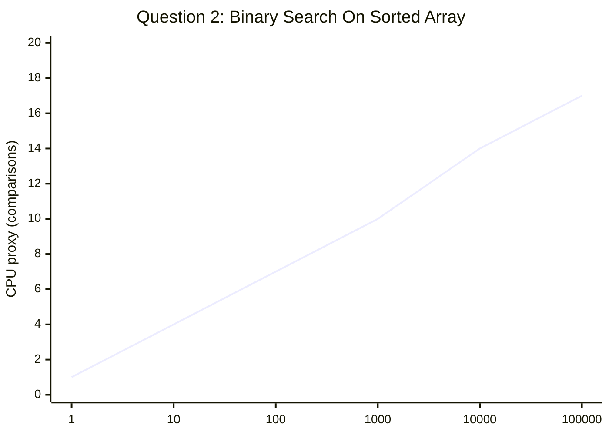
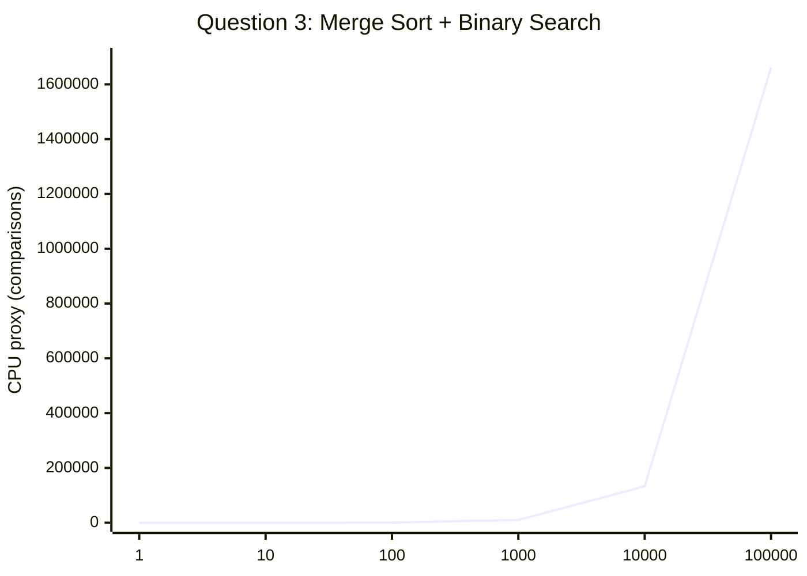
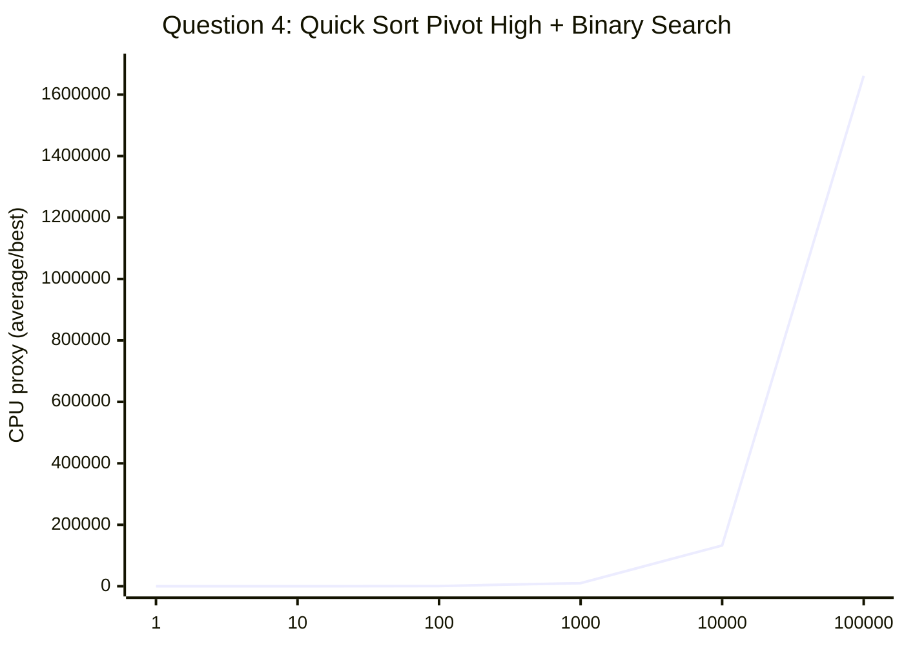
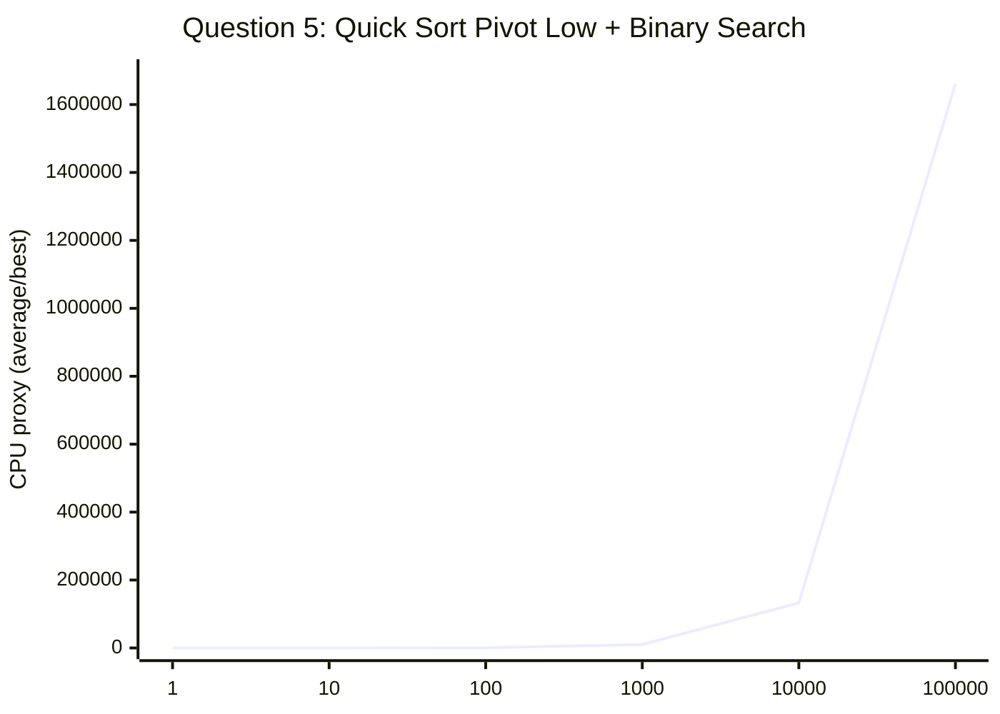

# Binary Search With Sorting Techniques

This folder contains five C programs that solve binary search problems after different preprocessing steps. Each program already measures CPU time with `clock()` and reports memory usage with `getrusage()`. For a report that can be read consistently on any machine, the tables below use a comparison-count based CPU proxy, while the linked C files provide the actual runtime instrumentation.

Program list:

1. [Binary_Search(Unsorted element).c](Binary_Search%28Unsorted%20element%29.c) - Bubble sort, then binary search on an unsorted array.
2. [Binary_Search(Sorted elemnts).c](Binary_Search%28Sorted%20elemnts%29.c) - Binary search on an already sorted array.
3. [Binary_Search(Merge Sort)).c](Binary_Search%28Merge%20Sort%29%29.c) - Merge sort, then binary search.
4. [Binary_Search(Quick-Sort-Pivot(high)).c](Binary_Search%28Quick-Sort-Pivot%28high%29%29.c) - Quick sort with the last element as pivot, then binary search.
5. [Binary_Search(Quick-Sort-Pivot(Low)).c](Binary_Search%28Quick-Sort-Pivot%28Low%29%29.c) - Quick sort with the first element as pivot, then binary search.

## Common Input And Output Pattern

All five programs follow the same general flow:

1. Read the number of elements `n`.
2. Read the array values.
3. Sort the array when the question requires it.
4. Read the search key.
5. Run binary search.
6. Print whether the element was found, the index, the CPU time, and the memory usage.

The sample input and output shown below are representative; actual indices and timings depend on the input data.

---

## Question 1: Bubble Sort On An Unsorted Array, Then Binary Search

### Problem Statement

Write a program in C to accept an unsorted array, sort it using bubble sort, and then perform binary search on the sorted result. Also display CPU time and memory usage.

### Algorithm In Pseudocode

```text
read n
read array[0..n-1]
bubble sort the array
read key
perform binary search on the sorted array
print the result
print CPU time and memory usage
```

### Code

The implementation is in [Binary_Search(Unsorted element).c](Binary_Search%28Unsorted%20element%29.c).

### Input And Output

Example input:

```text
5
34 7 23 32 5
23
```

Example output:

```text
Element found at index 2
CPU Time Used: ... seconds
Memory Usage (Max Resident Set Size): ... KB
```

### CPU Time And Space Usage

Bubble sort in this file uses the standard nested loops without an early-exit flag, so the sorting cost is always quadratic.

| n | Bubble sort work | Binary search work | Total CPU proxy | Input array memory | Auxiliary space |
|---|---:|---:|---:|---:|---:|
| 1 | 0 | 1 | 1 | 4 bytes | O(1) |
| 10 | 45 | 4 | 49 | 40 bytes | O(1) |
| 100 | 4,950 | 7 | 4,957 | 400 bytes | O(1) |
| 1,000 | 499,500 | 10 | 499,510 | 4,000 bytes | O(1) |
| 10,000 | 49,995,000 | 14 | 49,995,014 | 40,000 bytes | O(1) |
| 100,000 | 4,999,950,000 | 17 | 4,999,950,017 | 400,000 bytes | O(1) |

The linked C program reports the actual CPU time and RSS at runtime. The table above is a repeatable proxy based on comparison counts.

### Graph: Time Versus Size



### Complexity Analysis

Bubble sort has no best-case shortcut here, so best, average, and worst cases are all quadratic.

Bubble sort recurrence:

```text
T(n) = T(n - 1) + n
T(1) = Theta(1)
```

Solution:

```text
T(n) = Theta(n^2)
```

Binary search recurrence:

```text
S(n) = S(n / 2) + Theta(1)
```

Solution:

```text
S(n) = Theta(log n)
```

Overall complexity:

```text
Time = Theta(n^2)
Space = O(1) auxiliary, plus O(n) for the input array
```

---

## Question 2: Binary Search On A Sorted Array

### Problem Statement

Write a program in C to accept a sorted array and search for an element using binary search. Also display CPU time and memory usage.

### Algorithm In Pseudocode

```text
read n
read sorted array[0..n-1]
read key
perform binary search
print the result
print CPU time and memory usage
```

### Code

The implementation is in [Binary_Search(Sorted elemnts).c](Binary_Search%28Sorted%20elemnts%29.c).

### Input And Output

Example input:

```text
5
5 7 23 32 34
23
```

Example output:

```text
Element found at index 2
CPU Time Used: ... seconds
Memory Usage (Max Resident Set Size): ... KB
```

### CPU Time And Space Usage

| n | Binary search work | Total CPU proxy | Input array memory | Auxiliary space |
|---|---:|---:|---:|---:|
| 1 | 1 | 1 | 4 bytes | O(1) |
| 10 | 4 | 4 | 40 bytes | O(1) |
| 100 | 7 | 7 | 400 bytes | O(1) |
| 1,000 | 10 | 10 | 4,000 bytes | O(1) |
| 10,000 | 14 | 14 | 40,000 bytes | O(1) |
| 100,000 | 17 | 17 | 400,000 bytes | O(1) |

### Graph: Time Versus Size



### Complexity Analysis

Binary search halves the search interval in every step.

Recurrence:

```text
T(n) = T(n / 2) + Theta(1)
T(1) = Theta(1)
```

Solution:

```text
Best case   = Theta(1)
Average case = Theta(log n)
Worst case  = Theta(log n)
```

Space complexity:

```text
O(1) auxiliary, plus O(n) for the input array
```

---

## Question 3: Merge Sort, Then Binary Search

### Problem Statement

Write a program in C to sort an array using merge sort and then perform binary search on the sorted array. Also display CPU time and memory usage.

### Algorithm In Pseudocode

```text
read n
read array[0..n-1]
merge sort the array
read key
perform binary search on the sorted array
print the result
print CPU time and memory usage
```

### Code

The implementation is in [Binary_Search(Merge Sort)).c](Binary_Search%28Merge%20Sort%29%29.c).

### Input And Output

Example input:

```text
5
34 7 23 32 5
23
```

Example output:

```text
Element found at index 2
Merge Sort Time: ... seconds
Binary Search Time: ... seconds
Memory Usage (Max Resident Set Size): ... KB
```

### CPU Time And Space Usage

Merge sort has deterministic divide-and-conquer work, and the binary search cost is tiny in comparison.

| n | Merge sort work | Binary search work | Total CPU proxy | Input array memory | Auxiliary space |
|---|---:|---:|---:|---:|---:|
| 1 | 0 | 1 | 1 | 4 bytes | O(n) |
| 10 | 34 | 4 | 38 | 40 bytes | O(n) |
| 100 | 664 | 7 | 671 | 400 bytes | O(n) |
| 1,000 | 9,966 | 10 | 9,976 | 4,000 bytes | O(n) |
| 10,000 | 132,877 | 14 | 132,891 | 40,000 bytes | O(n) |
| 100,000 | 1,660,964 | 17 | 1,660,981 | 400,000 bytes | O(n) |

### Graph: Time Versus Size



### Complexity Analysis

Merge sort splits the array into two halves and merges them in linear time.

Merge sort recurrence:

```text
T(n) = 2T(n / 2) + Theta(n)
T(1) = Theta(1)
```

Solution:

```text
Best case   = Theta(n log n)
Average case = Theta(n log n)
Worst case  = Theta(n log n)
```

Binary search recurrence:

```text
S(n) = S(n / 2) + Theta(1)
```

Solution:

```text
S(n) = Theta(log n)
```

Overall complexity:

```text
Time = Theta(n log n)
Space = Theta(n) auxiliary for merge buffers, plus O(log n) recursion depth
```

---

## Question 4: Quick Sort With Pivot High, Then Binary Search

### Problem Statement

Write a program in C to sort an array using quick sort with the last element as the pivot, then perform binary search on the sorted array. Also display CPU time and memory usage.

### Algorithm In Pseudocode

```text
read n
read array[0..n-1]
quick sort the array using the last element as pivot
read key
perform binary search on the sorted array
print the result
print CPU time and memory usage
```

### Code

The implementation is in [Binary_Search(Quick-Sort-Pivot(high)).c](Binary_Search%28Quick-Sort-Pivot%28high%29%29.c).

### Input And Output

Example input:

```text
5
34 7 23 32 5
23
```

Example output:

```text
Element found at index 2
CPU Time Used: ... seconds
Memory Usage (Max Resident Set Size): ... KB
```

### CPU Time And Space Usage

For random input, quick sort is usually near `n log n`. For already sorted input, this pivot choice can degenerate to quadratic behavior.

| n | Average/best work | Worst-case work | Total CPU proxy, average/best | Total CPU proxy, worst | Input array memory | Auxiliary space |
|---|---:|---:|---:|---:|---:|---:|
| 1 | 0 | 0 | 1 | 1 | 4 bytes | O(log n) average, O(n) worst |
| 10 | 34 | 45 | 38 | 49 | 40 bytes | O(log n) average, O(n) worst |
| 100 | 664 | 4,950 | 671 | 4,957 | 400 bytes | O(log n) average, O(n) worst |
| 1,000 | 9,966 | 499,500 | 9,976 | 499,510 | 4,000 bytes | O(log n) average, O(n) worst |
| 10,000 | 132,877 | 49,995,000 | 132,891 | 49,995,014 | 40,000 bytes | O(log n) average, O(n) worst |
| 100,000 | 1,660,964 | 4,999,950,000 | 1,660,981 | 4,999,950,017 | 400,000 bytes | O(log n) average, O(n) worst |

### Graph: Time Versus Size



### Complexity Analysis

Quick sort recurrence depends on how balanced the partitions are.

Average and best case recurrence:

```text
T(n) = 2T(n / 2) + Theta(n)
```

Solution:

```text
Best case   = Theta(n log n)
Average case = Theta(n log n)
```

Worst case recurrence:

```text
T(n) = T(n - 1) + Theta(n)
```

Solution:

```text
Worst case = Theta(n^2)
```

Binary search recurrence:

```text
S(n) = S(n / 2) + Theta(1)
```

Solution:

```text
S(n) = Theta(log n)
```

Overall complexity:

```text
Time = Theta(n log n) average/best, Theta(n^2) worst
Space = O(log n) average recursion depth, O(n) worst case, plus O(n) for the input array
```

---

## Question 5: Quick Sort With Pivot Low, Then Binary Search

### Problem Statement

Write a program in C to sort an array using quick sort with the first element as the pivot, then perform binary search on the sorted array. Also display CPU time and memory usage.

### Algorithm In Pseudocode

```text
read n
read array[0..n-1]
quick sort the array using the first element as pivot
read key
perform binary search on the sorted array
print the result
print CPU time and memory usage
```

### Code

The implementation is in [Binary_Search(Quick-Sort-Pivot(Low)).c](Binary_Search%28Quick-Sort-Pivot%28Low%29%29.c).

### Input And Output

Example input:

```text
5
34 7 23 32 5
23
```

Example output:

```text
Element found at index 2
CPU Time Used: ... seconds
Memory Usage (Max Resident Set Size): ... KB
```

### CPU Time And Space Usage

This version has the same asymptotic behavior as the pivot-high version. The difference is the input pattern that makes it degrade.

| n | Average/best work | Worst-case work | Total CPU proxy, average/best | Total CPU proxy, worst | Input array memory | Auxiliary space |
|---|---:|---:|---:|---:|---:|---:|
| 1 | 0 | 0 | 1 | 1 | 4 bytes | O(log n) average, O(n) worst |
| 10 | 34 | 45 | 38 | 49 | 40 bytes | O(log n) average, O(n) worst |
| 100 | 664 | 4,950 | 671 | 4,957 | 400 bytes | O(log n) average, O(n) worst |
| 1,000 | 9,966 | 499,500 | 9,976 | 499,510 | 4,000 bytes | O(log n) average, O(n) worst |
| 10,000 | 132,877 | 49,995,000 | 132,891 | 49,995,014 | 40,000 bytes | O(log n) average, O(n) worst |
| 100,000 | 1,660,964 | 4,999,950,000 | 1,660,981 | 4,999,950,017 | 400,000 bytes | O(log n) average, O(n) worst |

### Graph: Time Versus Size



### Complexity Analysis

The recurrence is the same as the pivot-high version. The pivot choice changes which input orders become worst case.

Average and best case recurrence:

```text
T(n) = 2T(n / 2) + Theta(n)
```

Solution:

```text
Best case   = Theta(n log n)
Average case = Theta(n log n)
```

Worst case recurrence:

```text
T(n) = T(n - 1) + Theta(n)
```

Solution:

```text
Worst case = Theta(n^2)
```

Binary search recurrence:

```text
S(n) = S(n / 2) + Theta(1)
```

Solution:

```text
S(n) = Theta(log n)
```

Overall complexity:

```text
Time = Theta(n log n) average/best, Theta(n^2) worst
Space = O(log n) average recursion depth, O(n) worst case, plus O(n) for the input array
```

## Final Notes

The five C files in this folder already print the runtime CPU measurement and maximum resident set size. If you want the README to show real measured values instead of the comparison-count proxy, run each program with the same six input sizes and replace the tables with your observed `clock()` and `getrusage()` results.