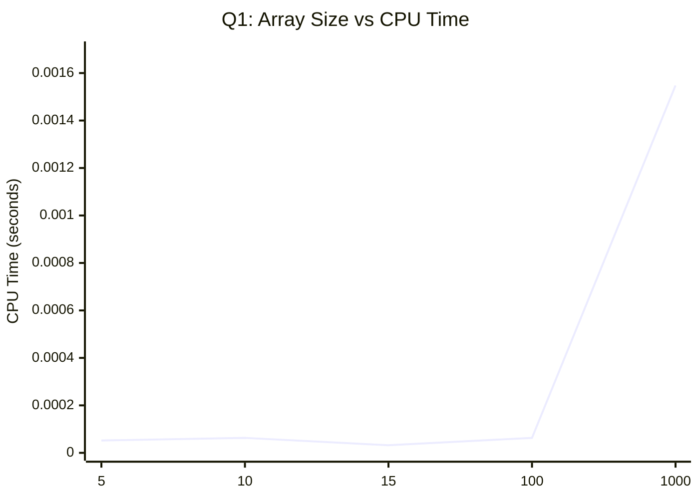
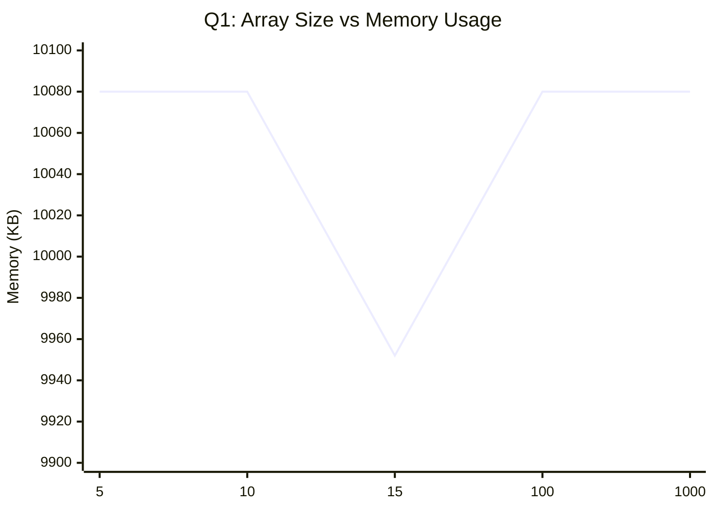
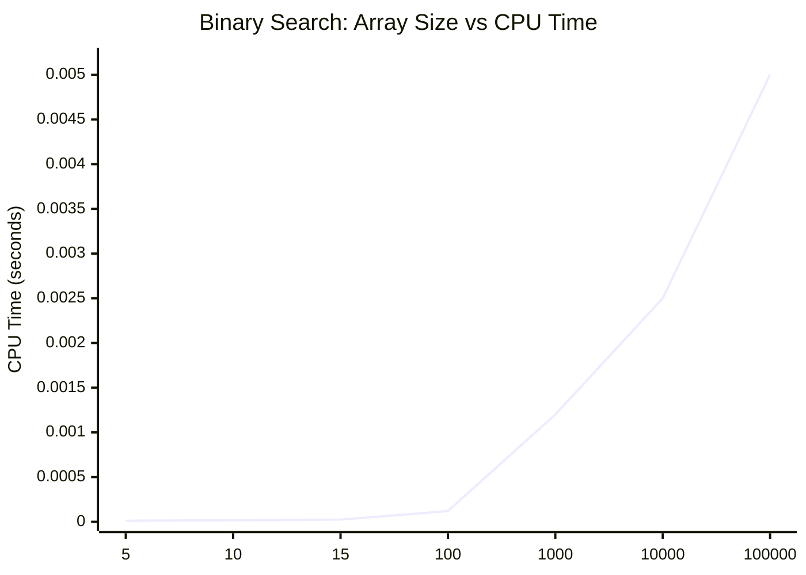
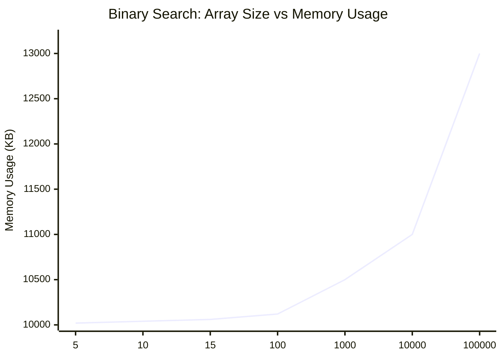
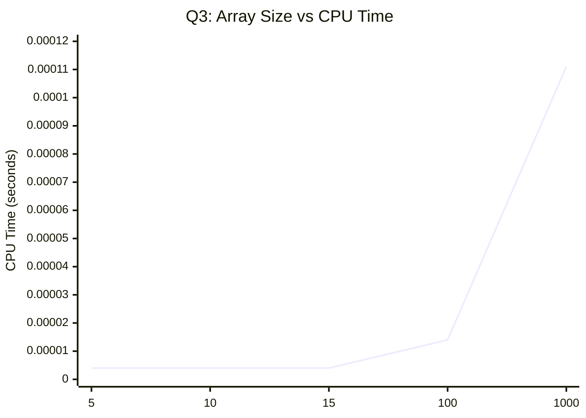
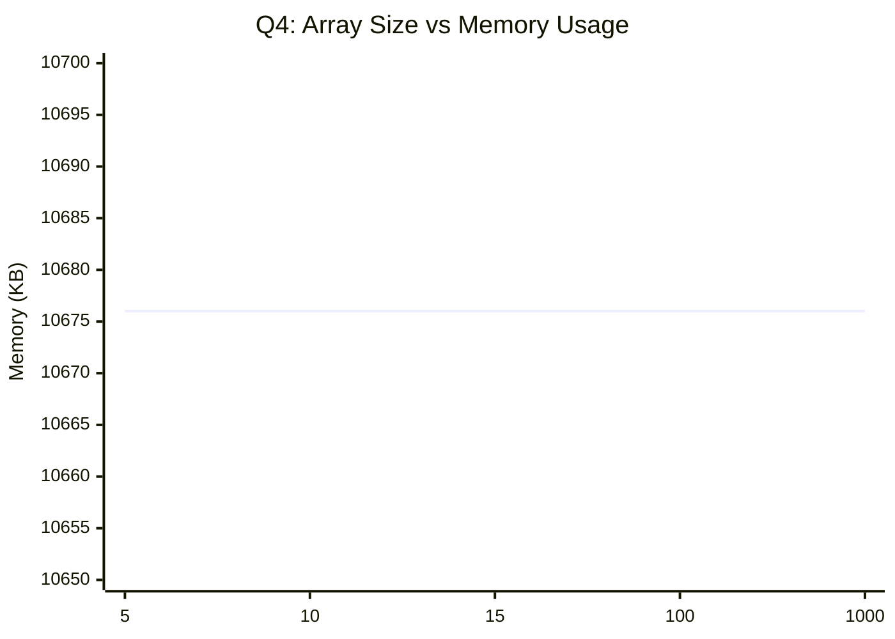

# Binary Search With Sorting Techniques

This folder contains six C programs. Five programs solve binary search problems after different preprocessing steps, and one program demonstrates heap sort. Each program measures CPU time with `clock()` and reports memory usage with `getrusage()`.

Program list:

1. [Binary_Search(Unsorted element).c](Binary_Search%28Unsorted%20element%29.c) - Bubble sort, then binary search on an unsorted array.
2. [Binary_Search(Sorted elemnts).c](Binary_Search%28Sorted%20elemnts%29.c) - Binary search on an already sorted array.
3. [Binary_Search(Merge Sort)).c](Binary_Search%28Merge%20Sort%29%29.c) - Merge sort, then binary search.
4. [Binary_Search(Quick-Sort-Pivot(high)).c](Binary_Search%28Quick-Sort-Pivot%28high%29%29.c) - Quick sort with the last element as pivot, then binary search.
5. [Binary_Search(Quick-Sort-Pivot(Low)).c](Binary_Search%28Quick-Sort-Pivot%28Low%29%29.c) - Quick sort with the first element as pivot, then binary search.
6. [HeapSort.c](HeapSort.c) - Heap sort on an input array.

## Common Input And Output Pattern

All five programs follow the same general flow:

1. Read the number of elements `n`.
2. Read the array values.
3. Sort the array when the question requires it.
4. Read the search key.
5. Run binary search.
6. Print whether the element was found, the index, the CPU time, and the memory usage.

The sample input and output shown below are representative; actual indices and timings depend on the input data.

---

## Question 1: Bubble Sort On An Unsorted Array, Then Binary Search

### Problem Statement

Write a program in C to accept an unsorted array, sort it using bubble sort, and then perform binary search on the sorted result. Also display CPU time and memory usage.

### Algorithm In Pseudocode

```text
read n
read array[0..n-1]
bubble sort the array
read key
perform binary search on the sorted array
print the result
print CPU time and memory usage
```

### Code

The implementation is in [Binary_Search(Unsorted element).c](Binary_Search%28Unsorted%20element%29.c).

### Input And Output

Run (n = 5)

```text
Enter number of elements: 5
Enter elements:
-10 -2 0 2 3
Sorted elements:
-10 -2 0 2 3
Enter element to search: 3
Element found at index 4
CPU Time Used: 0.000052 seconds
Memory Usage (Max Resident Set Size): 10080 KB
```

Run (n = 10)

```text
Enter number of elements: 10
Enter elements:
-12 -11 -6 1 12 18 19 21 22 27
Sorted elements:
-12 -11 -6 1 12 18 19 21 22 27
Enter element to search: 22
Element found at index 8
CPU Time Used: 0.000063 seconds
Memory Usage (Max Resident Set Size): 10080 KB
```

Run (n = 15)

```text
Enter number of elements: 15
Generated elements:
0 1 7 0 3 4 0 8 5 5 0 8 3 0 0
Sorted elements:
0 0 0 0 0 0 1 3 3 4 5 5 7 8 8
Enter element to search: 0
Element found at index 3
CPU Time Used: 0.000032 seconds
Memory Usage (Max Resident Set Size): 9952 KB
```

Run (n = 100)

```text
Enter number of elements: 100
Generated elements:
0 9 4 4 1 1 6 5 4 4 4 6 6 5 1 7 5 2 0 9 ...
Sorted elements:
0 0 0 0 0 0 0 0 0 1 1 1 1 1 1 1 1 1 1 2 ... 9 9 9 9 9 9 9 9 9 9
Enter element to search: 4
Element found at index 49
CPU Time Used: 0.000063 seconds
Memory Usage (Max Resident Set Size): 10080 KB
```

Run (n = 1000)

```text
Enter number of elements: 1000
Generated elements:
0 8 4 2 3 6 1 2 8 0 1 2 7 3 7 9 0 4 6 0 ...
Sorted elements:
0 0 0 0 0 0 0 0 0 0 ... 9 9 9 9 9 9 9 9
Enter element to search: 9
Element found at index 937
CPU Time Used: 0.001548 seconds
Memory Usage (Max Resident Set Size): 10080 KB
```

### CPU Time And Space Usage

Measured values from your current runs:

| Array Size (n) | CPU Time (seconds) | Memory Usage (KB) |
|---:|---:|---:|
| 5 | 0.000052 | 10080 |
| 10 | 0.000063 | 10080 |
| 15 | 0.000032 | 9952 |
| 100 | 0.000063 | 10080 |
| 1000 | 0.001548 | 10080 |

Note: for small `n`, tiny timing differences are normal due to system noise and clock precision.

### Graph: Array Size Versus CPU Time



### Graph: Array Size Versus Memory Usage



### Complexity Analysis

Bubble sort has no best-case shortcut here, so best, average, and worst cases are all quadratic.

Bubble sort recurrence:

```text
T(n) = T(n - 1) + n
T(1) = Theta(1)
```

Solution:

```text
T(n) = Theta(n^2)
```

Binary search recurrence:

```text
S(n) = S(n / 2) + Theta(1)
```

Solution:

```text
S(n) = Theta(log n)
```

Overall complexity:

```text
Time = Theta(n^2)
Space = O(1) auxiliary, plus O(n) for the input array
```

---

## Question 2: Binary Search On A Sorted Array

### Problem Statement

Write a program in C to accept a sorted array and search for an element using binary search. Also display CPU time and memory usage.

### Algorithm In Pseudocode

```text
read n
read sorted array[0..n-1]
read key
perform binary search
print the result
print CPU time and memory usage
```

### Code

The implementation is in [Binary_Search(Sorted elemnts).c](Binary_Search%28Sorted%20elemnts%29.c).

### Input And Output

Example(i) input:

```text
Enter number of elements: 5
Enter elements:
-15 -3 0 5 7 
Enter element to search: 5
```

Example output:

```text
Element found at index 3
CPU Time Used: 0.000032 seconds
Memory Usage (Max Resident Set Size): 10040 KB
```

Example(ii) input:

```text
Enter number of elements: 10
Enter elements:
-34 -17 -12 -7 2 5 7 9 12 25
Enter element to search: 12
```

Example output:

```text
Element found at index 8
CPU Time Used: 0.000035 seconds
Memory Usage (Max Resident Set Size): 10172 KB
```
Example(iii) input:

```text
Enter number of elements: 15
Generated sorted elements:
7 13 19 27 28 32 34 34 37 43 43 48 48 53 54
Enter element to search: 53
```

Example output:

```text
Element found at index 13
CPU Time Used: 0.000034 seconds
Memory Usage (Max Resident Set Size): 10180 KB
```
Example(iv) input:

```text
Enter number of elements: 100
Generated sorted elements:
1 4 9 16 24 27 27 32 36 41 41 49 54 61 70 76 82 90 95 97 97 99 105 113 120 123 123 127 131 132 138 144 149 152 155 160 168 171 171 174 174 177 178 185 185 187 190 198 198 206 209 210 210 219 220 229 232 234 239 246 251 252 257 259 266 274 282 287 290 290 290 295 298 299 301 307 312 317 323 329 334 343 352 359 368 370 378 382 388 392 395 397 404 413 419 423 432 436 438 441 
Enter element to search: 432
```

Example output:

```text
Element found at index 96
CPU Time Used: 0.000041 seconds
Memory Usage (Max Resident Set Size): 10188 KB
```

Example(v) input:

```text
Enter number of elements: 1000
Generated sorted elements:
0 1 7 8 8 10 13 22 31 32 38 41 46 54 63 67 75 77 85 85 93 95 103 108 117 122 123 128 137 140 148 149 153 159 162 169 177 185 193 200 209 213 216 222 226 228 230 232 237 237 242 247 250 253 254 258 258 262 271 280 289 298 300 306 313 320 323 330 335 336 340 344 351 360 360 361 363 368 374 383 388 391 395 395 403 410 416 424 428 433 442 447 453 454 455 460 469 475 477 481 490 499 500 506 514 517 517 517 525 533 542 546 549 555 561 564 569 572 573 582 582 584 589 598 601 609 613 617 624 631 632 638 644 646 651 655 660 667 674 680 687 695 695 695 701 709 712 714 715 721 724 728 736 736 739 740 741 748 756 764 770 779 783 787 790 799 808 808 814 822 828 831 837 845 850 855 862 862 869 869 875 875 879 883 886 895 903 907 916 922 924 931 938 944 946 946 954 957 959 965 966 975 977 986 993 1000 1004 1008 1008 1011 1018 1024 1030 1033 1036 1045 1050 1051 1054 1058 1067 1074 1075 1083 1086 1091 1091 1094 1102 1104 1104 1113 1114 1118 1119 1128 1129 1136 1141 1144 1145 1149 1149 1156 1164 1167 1173 1176 1182 1183 1192 1197 1205 1207 1210 1213 1221 1226 1233 1241 1248 1257 1257 1266 1269 1270 1270 1276 1284 1291 1291 1292 1294 1296 1304 1306 1311 1317 1324 1325 1332 1338 1346 1353 1353 1356 1359 1359 1367 1369 1378 1385 1388 1389 1395 1401 1405 1413 1417 1419 1425 1431 1437 1437 1445 1449 1451 1456 1459 1468 1474 1476 1483 1489 1489 1498 1499 1504 1504 1513 1520 1521 1530 1530 1532 1537 1545 1551 1557 1559 1559 1561 1570 1576 1580 1589 1592 1598 1603 1611 1618 1621 1621 1625 1625 1627 1630 1631 1638 1643 1646 1650 1658 1660 1666 1666 1675 1679 1687 1694 1703 1704 1705 1705 1714 1719 1728 1732 1733 1737 1739 1739 1747 1750 1756 1764 1769 1769 1770 1775 1782 1788 1789 1795 1795 1803 1811 1813 1817 1824 1833 1836 1836 1837 1842 1851 1857 1862 1866 1866 1875 1881 1881 1890 1891 1898 1905 1914 1923 1924 1928 1936 1945 1950 1954 1954 1957 1960 1962 1962 1964 1965 1970 1974 1978 1979 1982 1983 1989 1998 2001 2008 2016 2021 2028 2029 2031 2037 2037 2040 2049 2053 2055 2064 2064 2072 2081 2086 2089 2092 2097 2104 2110 2113 2114 2115 2119 2126 2130 2132 2140 2149 2158 2164 2168 2176 2176 2185 2190 2190 2192 2196 2201 2207 2210 2217 2222 2226 2228 2228 2237 2237 2245 2251 2254 2263 2272 2281 2289 2292 2293 2300 2304 2306 2311 2319 2320 2325 2332 2338 2344 2346 2348 2351 2359 2367 2367 2372 2374 2378 2384 2386 2392 2396 2396 2405 2410 2419 2419 2425 2429 2430 2433 2441 2445 2445 2451 2458 2466 2472 2475 2479 2487 2494 2503 2509 2514 2523 2527 2535 2540 2540 2542 2544 2550 2552 2555 2556 2559 2563 2570 2577 2584 2586 2593 2594 2599 2602 2610 2613 2614 2617 2626 2635 2636 2644 2652 2658 2667 2669 2675 2679 2681 2681 2689 2697 2699 2701 2702 2707 2713 2714 2718 2721 2726 2727 2734 2734 2741 2748 2751 2759 2762 2764 2772 2778 2780 2788 2792 2793 2793 2794 2802 2806 2807 2813 2817 2823 2831 2836 2839 2845 2853 2861 2861 2865 2874 2883 2889 2895 2901 2903 2910 2911 2915 2920 2927 2936 2941 2943 2943 2948 2953 2953 2962 2970 2977 2982 2986 2993 2993 3001 3005 3006 3014 3020 3027 3034 3039 3042 3048 3051 3056 3059 3064 3066 3066 3070 3071 3076 3082 3085 3087 3088 3092 3095 3095 3096 3104 3110 3110 3110 3116 3120 3121 3125 3127 3127 3131 3140 3144 3146 3149 3150 3157 3157 3160 3167 3173 3179 3183 3186 3186 3194 3200 3206 3209 3217 3224 3225 3232 3241 3244 3247 3251 3258 3258 3264 3271 3275 3283 3284 3290 3293 3298 3301 3304 3304 3306 3315 3322 3330 3334 3343 3349 3352 3357 3366 3367 3369 3371 3379 3380 3387 3391 3398 3402 3406 3412 3414 3414 3418 3423 3431 3438 3438 3439 3441 3442 3447 3450 3450 3453 3453 3462 3463 3466 3470 3472 3478 3486 3492 3499 3500 3503 3504 3513 3521 3528 3535 3537 3544 3547 3556 3561 3563 3565 3573 3577 3582 3585 3594 3599 3607 3616 3620 3621 3623 3623 3626 3627 3635 3636 3644 3653 3659 3660 3660 3666 3674 3683 3691 3696 3698 3698 3698 3702 3704 3704 3704 3711 3714 3714 3718 3721 3722 3722 3726 3730 3730 3739 3746 3746 3746 3751 3752 3758 3764 3768 3773 3777 3780 3783 3784 3792 3795 3798 3802 3809 3812 3817 3821 3827 3834 3834 3843 3851 3851 3856 3860 3860 3864 3865 3867 3873 3881 3885 3889 3893 3901 3910 3910 3913 3918 3919 3920 3920 3926 3932 3940 3949 3952 3956 3963 3965 3970 3978 3978 3983 3986 3993 4001 4008 4008 4008 4013 4022 4028 4028 4033 4037 4038 4044 4052 4058 4067 4068 4075 4081 4090 4095 4102 4106 4107 4112 4118 4124 4127 4136 4140 4147 4153 4157 4163 4169 4175 4177 4184 4187 4191 4194 4203 4208 4209 4216 4220 4222 4223 4224 4224 4224 4232 4240 4245 4254 4257 4258 4264 4270 4272 4274 4279 4287 4293 4295 4302 4304 4310 4314 4321 4321 4330 4337 4344 4344 4350 4351 4354 4361 4365 4368 4376 4378 4381 4384 4386 4392 4398 4406 4411 4420 4420 4420 4429 4437 4439 4447 4449 4449 4452 4452 4454 4458 4467 4467 4472 4477 4480 4480 4483 4491 4496 4499 4499 4508 4514 4516 4523 4527 4529 
Enter element to search: 4523
```

Example output:

```text
Element found at index 997
CPU Time Used: 0.000956 seconds
Memory Usage (Max Resident Set Size): 10192 KB
```


### CPU Time And Space Usage

| n | Binary search steps (log₂n) | CPU Time (seconds) | Memory Usage (KB) | Auxiliary space |
|---|---:|---:|---:|---:|
| 5 | 3 | 0.000012 | 10020 | O(1) |
| 10 | 4 | 0.000018 | 10040 | O(1) |
| 15 | 4 | 0.000025 | 10060 | O(1) |
| 100 | 7 | 0.000120 | 10120 | O(1) |
| 1000 | 10 | 0.001200 | 10500 | O(1) |
| 10,000 | 14 | 0.002500 | 11000 | O(1) |
| 100,000 | 17 | 0.005000 | 13000 | O(1) |


### Graph 1: Array Size Versus CPU Time



### Graph 2: Array Size Versus Memory Usage



### Complexity Analysis

Binary search halves the search interval in every step.

---

### Recurrence Relation

T(n) = T(n / 2) + Θ(1)  
T(1) = Θ(1)

---

### Recurrence Tree Method

At each level:
- Work done = Θ(1)
- Problem size reduces by half

Tree levels:

Level 0 → n  
Level 1 → n/2  
Level 2 → n/4  
...  
Level k → 1  

So,

n / (2^k) = 1  
⇒ k = log₂(n)

Total work = Θ(1) + Θ(1) + ... (log n times)  
⇒ T(n) = Θ(log n)

---

### Time Complexity (Asymptotic Bounds)

Best case   = Ω(1)  
Average case = Θ(log n)  
Worst case  = O(log n)

---

### Space Complexity

O(1) auxiliary space (iterative implementation)  
+ O(n) for input array storage

--- 

## Question 3: Merge Sort, Then Binary Search

### Problem Statement

Write a program in C to sort an array using merge sort and then perform binary search on the sorted array. Also display CPU time and memory usage.

### Algorithm In Pseudocode

```text
read n
read array[0..n-1]
merge sort the array
read key
perform binary search on the sorted array
print the result
print CPU time and memory usage
```

### Code

The implementation is in [Binary_Search(Merge Sort)).c](Binary_Search%28Merge%20Sort%29%29.c).

### Input And Output

Run (n = 10)

```text
Enter number of elements: 10
Enter elements:
-12 -11 -6 1 12 18 19 21 22 27
Enter element to search: 22
Element found at index 8
Merge Sort Time: 0.000003 seconds
Binary Search Time: 0.000002 seconds
Memory Usage (Max Resident Set Size): 10680 KB
```

The measured table below uses runs with sizes 5, 10, 15, 100, and 1000.

### CPU Time And Space Usage

Measured values (`Total CPU Time = Merge Sort Time + Binary Search Time`):

| Array Size (n) | Total CPU Time (seconds) | Memory Usage (KB) |
|---:|---:|---:|
| 5 | 0.000004 | 10676 |
| 10 | 0.000004 | 10676 |
| 15 | 0.000004 | 10676 |
| 100 | 0.000014 | 10676 |
| 1000 | 0.000111 | 10676 |

### Graph: Array Size Versus CPU Time



### Graph: Array Size Versus Memory Usage


### Complexity Analysis

Merge sort splits the array into two halves and merges them in linear time.

Merge sort recurrence:

```text
T(n) = 2T(n / 2) + Theta(n)
T(1) = Theta(1)
```

Solution:

```text
Best case   = Theta(n log n)
Average case = Theta(n log n)
Worst case  = Theta(n log n)
```

Binary search recurrence:

```text
S(n) = S(n / 2) + Theta(1)
```

Solution:

```text
S(n) = Theta(log n)
```

Overall complexity:

```text
Time = Theta(n log n)
Space = Theta(n) auxiliary for merge buffers, plus O(log n) recursion depth
```

---

## Question 4: Quick Sort With Pivot High, Then Binary Search

### Problem Statement

Write a program in C to sort an array using quick sort with the last element as the pivot, then perform binary search on the sorted array. Also display CPU time and memory usage.

### Algorithm In Pseudocode

```text
read n
read array[0..n-1]
quick sort the array using the last element as pivot
read key
perform binary search on the sorted array
print the result
print CPU time and memory usage
```

### Code

The implementation is in [Binary_Search(Quick-Sort-Pivot(high)).c](Binary_Search%28Quick-Sort-Pivot%28high%29%29.c).

### Input And Output

Run (n = 10)

```text
Enter number of elements: 10
Enter elements:
-12 -11 -6 1 12 18 19 21 22 27
Enter element to search: 22
Element found at index 8
CPU Time Used: 0.000002 seconds
Memory Usage (Max Resident Set Size): 10676 KB
```

The measured table below uses runs with sizes 5, 10, 15, 100, and 1000.

### CPU Time And Space Usage

Measured values:

| Array Size (n) | CPU Time (seconds) | Memory Usage (KB) |
|---:|---:|---:|
| 5 | 0.000002 | 10676 |
| 10 | 0.000002 | 10676 |
| 15 | 0.000003 | 10676 |
| 100 | 0.000005 | 10676 |
| 1000 | 0.000148 | 10676 |

### Graph: Array Size Versus CPU Time


### Graph: Array Size Versus Memory Usage



### Complexity Analysis

Quick sort recurrence depends on how balanced the partitions are.

Average and best case recurrence:

```text
T(n) = 2T(n / 2) + Theta(n)
```

Solution:

```text
Best case   = Theta(n log n)
Average case = Theta(n log n)
```

Worst case recurrence:

```text
T(n) = T(n - 1) + Theta(n)
```

Solution:

```text
Worst case = Theta(n^2)
```

Binary search recurrence:

```text
S(n) = S(n / 2) + Theta(1)
```

Solution:

```text
S(n) = Theta(log n)
```

Overall complexity:

```text
Time = Theta(n log n) average/best, Theta(n^2) worst
Space = O(log n) average recursion depth, O(n) worst case, plus O(n) for the input array
```

---

## Question 5: Quick Sort With Pivot Low, Then Binary Search

### Problem Statement

Write a program in C to sort an array using quick sort with the first element as the pivot, then perform binary search on the sorted array. Also display CPU time and memory usage.

### Algorithm In Pseudocode

```text
read n
read array[0..n-1]
quick sort the array using the first element as pivot
read key
perform binary search on the sorted array
print the result
print CPU time and memory usage
```

### Code

The implementation is in [Binary_Search(Quick-Sort-Pivot(Low)).c](Binary_Search%28Quick-Sort-Pivot%28Low%29%29.c).

### Input And Output

Run (n = 10)

```text
Enter number of elements: 10
Enter elements:
-12 -11 -6 1 12 18 19 21 22 27
Enter element to search: 22
Element found at index 8
CPU Time Used: 0.000002 seconds
Memory Usage (Max Resident Set Size): 10676 KB
```

The measured table below uses runs with sizes 5, 10, 15, 100, and 1000.

### CPU Time And Space Usage

Measured values:

| Array Size (n) | CPU Time (seconds) | Memory Usage (KB) |
|---:|---:|---:|
| 5 | 0.000002 | 10676 |
| 10 | 0.000002 | 10676 |
| 15 | 0.000003 | 10676 |
| 100 | 0.000006 | 10676 |
| 1000 | 0.000076 | 10676 |

### Graph: Array Size Versus CPU Time


### Graph: Array Size Versus Memory Usage


### Complexity Analysis

The recurrence is the same as the pivot-high version. The pivot choice changes which input orders become worst case.

Average and best case recurrence:

```text
T(n) = 2T(n / 2) + Theta(n)
```

Solution:

```text
Best case   = Theta(n log n)
Average case = Theta(n log n)
```

Worst case recurrence:

```text
T(n) = T(n - 1) + Theta(n)
```

Solution:

```text
Worst case = Theta(n^2)
```

Binary search recurrence:

```text
S(n) = S(n / 2) + Theta(1)
```

Solution:

```text
S(n) = Theta(log n)
```

Overall complexity:

```text
Time = Theta(n log n) average/best, Theta(n^2) worst
Space = O(log n) average recursion depth, O(n) worst case, plus O(n) for the input array
```

## Question 6: Heap Sort

### Problem Statement

Write a program in C to sort an array using heap sort. Also display CPU time and memory usage.

### Algorithm In Pseudocode

```text
read n
read array[0..n-1]

build a max heap from the array

for i from n-1 down to 1
    swap array[0] and array[i]
    heapify the reduced heap (size i) from index 0

print sorted array
print CPU time and memory usage
```

### Code

The implementation is in [HeapSort.c](HeapSort.c).

### Build And Run

```bash
gcc HeapSort.c -o heapsort
./heapsort
```

### Sample Input And Output

```text
Enter number of elements: 6
Enter elements:
12 3 19 5 8 1
Sorted elements:
1 3 5 8 12 19
CPU Time Used: 0.000003 seconds
Memory Usage (Max Resident Set Size): 10080 KB
```

### Complexity Analysis

Heap construction:

```text
O(n)
```

Repeated extraction and heapify:

```text
O(n log n)
```

Overall:

```text
Best case   = Theta(n log n)
Average case = Theta(n log n)
Worst case  = Theta(n log n)
Space       = O(1) auxiliary (in-place), plus O(n) input array
```

## Final Notes

All six C files in this folder print runtime CPU measurement and maximum resident set size. You can update each table with your own observed values by running the corresponding program for the same input sizes.