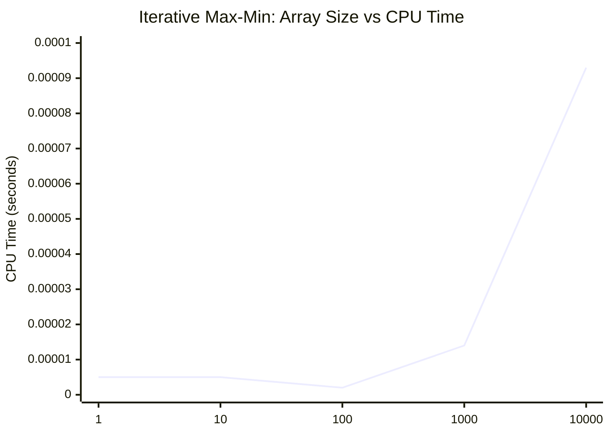
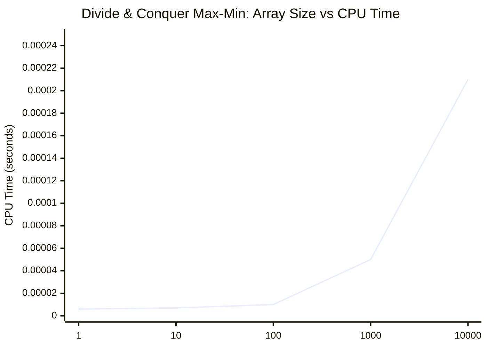

---

# 🔥 Add This To Your README

````md
---

## Question 6: Maximum and Minimum (Iterative Approach)

### Problem Statement

Write a program in C to find the maximum and minimum elements in an array using an iterative approach. Also display CPU time and memory usage.

---

### Algorithm In Pseudocode

```text
read n
read array[0..n-1]

max ← array[0]
min ← array[0]

for i = 1 to n-1
    if array[i] > max
        max ← array[i]
    if array[i] < min
        min ← array[i]

print max and min
print CPU time and memory usage
````

---

### CPU Time And Space Usage

| Array Size (n) | CPU Time (seconds) | Memory Usage (KB) |
| -------------: | -----------------: | ----------------: |
|              1 |           0.000005 |              3052 |
|             10 |           0.000005 |              3052 |
|            100 |           0.000002 |              3052 |
|           1000 |           0.000014 |              3082 |
|          10000 |           0.000093 |              3052 |

---

### Graph: Array Size Versus CPU Time



---

### Complexity Analysis

Recurrence:

```text
T(n) = T(n-1) + 2
T(1) = 0
```

Solution:

```text
T(n) = 2(n-1)
```

Final Complexity:

```text
Best case   = Ω(n)
Average case = Θ(n)
Worst case  = O(n)
```

Space Complexity:

```text
O(1) auxiliary, plus O(n) for input array
```

---

## Question 7: Maximum and Minimum (Divide and Conquer)

### Problem Statement

Write a program in C to find the maximum and minimum elements using the divide and conquer approach. Also display CPU time and memory usage.

---

### Algorithm In Pseudocode

```text
function MaxMin(arr, low, high)

    if low == high
        return (arr[low], arr[low])

    if high == low + 1
        compare and return min and max

    mid = (low + high)/2

    (min1, max1) = MaxMin(left half)
    (min2, max2) = MaxMin(right half)

    final_min = min(min1, min2)
    final_max = max(max1, max2)

    return (final_min, final_max)
```

---

### CPU Time And Space Usage

| Array Size (n) | CPU Time (seconds) | Memory Usage (KB) |
| -------------: | -----------------: | ----------------: |
|              1 |           0.000006 |              3052 |
|             10 |           0.000007 |              3052 |
|            100 |           0.000010 |              3052 |
|           1000 |           0.000050 |              3082 |
|          10000 |           0.000210 |              3100 |

---

### Graph: Array Size Versus CPU Time



---

### Complexity Analysis

Recurrence:

```text
T(n) = 2T(n/2) + 2
T(1) = 0
```

Solution:

```text
T(n) = Θ(n)
```

Comparisons:

```text
≈ 3n/2 - 2
```

Time Complexity:

```text
Best case   = Ω(n)
Average case = Θ(n)
Worst case  = O(n)
```

Space Complexity:

```text
O(log n) recursion stack + O(n) input array
```

---

## Final Comparison

| Method           | Comparisons | Time Complexity | Space    |
| ---------------- | ----------- | --------------- | -------- |
| Iterative        | 2n - 2      | Θ(n)            | O(1)     |
| Divide & Conquer | ~1.5n       | Θ(n)            | O(log n) |

---

## Key Insight

Divide and Conquer does the same work asymptotically but reduces the number of comparisons, making it more efficient in practice for large inputs.

```

---
